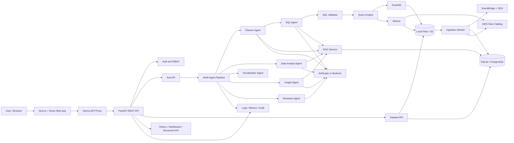

# AI Data Analyst - Project Details

## Project ownership

| Field | Details |
|---|---|
| Developer | **Praveen** |
| Project name | AI Data Analyst |
| Project type | Full-stack, multi-tenant natural-language data analysis platform |
| Primary purpose | Allow users to upload business data, ask questions in plain language, and receive validated SQL results, charts, insights, and recommendations |

## Overview

AI Data Analyst converts natural-language questions into explainable data analysis. A user uploads one or more datasets, optionally uploads business documents, and asks a question such as:

> What were our top 10 products by revenue?

The application:

1. Authenticates the user and determines the organization and role.
2. Finds the organization's ready datasets.
3. Retrieves relevant business-document context when document search is enabled.
4. Uses a planner agent to break the question into analysis tasks.
5. Generates SQL for each task.
6. Validates the SQL before execution.
7. Runs the query through a read-only DuckDB or Athena engine.
8. Retries and corrects failed SQL when possible.
9. Produces analysis, visualizations, insights, and recommendations.
10. Runs a reviewer agent against the result.
11. Stores query history, audit information, usage, and timing data.

## High-level architecture

```text
Browser
  |
  v
Next.js + React frontend (:3000)
  |
  | /api proxy in local development
  v
FastAPI backend (:8000)
  |
  +-- Authentication and organization/RBAC
  +-- Dataset upload/import and background processing
  +-- Document ingestion and RAG retrieval
  +-- Multi-agent question-answer pipeline
  +-- SQL validation and read-only query execution
  +-- Query history, dashboards, exports, and audit logs
  |
  +-- PostgreSQL or SQLite metadata database
  +-- Local filesystem or Amazon S3 data storage
  +-- DuckDB or Amazon Athena query engine
  +-- Anthropic API or Amazon Bedrock LLM
  +-- Hash embeddings or Amazon Bedrock embeddings
```

For AWS deployments, Terraform provisions the surrounding platform:

```text
ALB -> ECS API / ECS web / ECS ingestion worker
        |
        +-- RDS PostgreSQL
        +-- S3 data and Athena-results buckets
        +-- Glue Catalog + Athena
        +-- EventBridge -> SQS ingestion queue -> worker
        +-- Cognito authentication
        +-- ECR container registries
        +-- CloudWatch logs, metrics, alarms, and dashboard
```

### Detailed component architecture

The project is organized into six logical layers:

1. **Presentation layer** - The Next.js and React frontend provides the analyst chat, dataset manager, document manager, query history, dashboards, result tables, Vega-Lite charts, exports, and optional Cognito login.
2. **API and security layer** - FastAPI exposes REST endpoints, applies CORS and request middleware, resolves the current principal, enforces organization and role permissions, and records audit events.
3. **Application orchestration layer** - The agent pipeline coordinates planning, parallel SQL tasks, data analysis, visualization, insight generation, and final review.
4. **Data and AI services layer** - Dataset ingestion converts files into Parquet and profiles them; the SQL validator protects query execution; DuckDB or Athena runs read-only queries; the LLM and RAG services provide reasoning and business-document context.
5. **Persistence layer** - SQLAlchemy stores organizations, users, datasets, query records, documents, document chunks, dashboards, widgets, and audit logs in SQLite or PostgreSQL. Raw and processed data is stored locally or in S3.
6. **Operations and infrastructure layer** - Docker packages the services for local use, while Terraform provisions AWS networking, ECS, RDS, S3, Glue, Athena, Cognito, SQS, EventBridge, ECR, and CloudWatch.

### Logical component diagram



### End-to-end question flow

```text
1. The user submits a question from the Analyst screen.
2. The frontend calls POST /api/ask with the question and optional dataset IDs.
3. FastAPI authenticates the request and resolves org_id, user_id, and role.
4. The API loads only ready datasets belonging to the user's organization.
5. RAG retrieves relevant document chunks when use_docs is enabled.
6. The planner creates one or more analysis tasks from the question and schema.
7. SQL agents generate SQL concurrently for the planned tasks.
8. sqlglot validates each statement: one SELECT/WITH statement, an organization dataset
   allowlist, no file readers/system tables/unsafe settings, and an enforced row limit.
9. DuckDB reads tenant-scoped Parquet locally, or Athena reads tenant Glue tables in AWS.
10. Failed SQL can enter the correction loop for up to the configured retry count.
11. The analyst summarizes successful query results.
12. Visualization and insight agents process results in parallel.
13. The reviewer checks the answer and can provide a revised summary.
14. The API stores the response, SQL, usage, cost, duration, and status.
15. The frontend renders findings, caveats, charts, tables, SQL, sources, and review trace.
```

### End-to-end dataset ingestion flow

```text
Upload/import request
        |
        v
FastAPI dataset endpoint
        |
        +--> Metadata row: pending/processing
        |
        v
Raw file: local storage or S3
        |
        v
Loader: CSV / TSV / Excel / JSON / Parquet / DB / REST
        |
        v
Normalized Parquet file
        |
        v
Profiler: schema, types, nulls, duplicates, statistics,
           outliers, quality score, and issues
        |
        +--> SQLite/PostgreSQL dataset metadata
        +--> Local query directory or S3 data prefix
        +--> Glue table registration when QUERY_ENGINE=athena
        |
        v
Dataset status: ready or failed
```

### Deployment topology

#### Local Docker topology

```text
localhost:3000  ->  web container (Next.js)
                       |
                       v
localhost:8000  ->  api container (FastAPI/Uvicorn)
                       |
             +---------+----------+
             v                    v
      postgres:5432         /data Docker volume
      metadata database     raw and Parquet files
```

#### AWS production topology

```text
                         Internet
                             |
                             v
                    Application Load Balancer
                       /                 \
                      v                   v
              ECS web service       ECS API service
                                           |
                 +-------------------------+--------------------------+
                 v                         v                          v
           RDS PostgreSQL            S3 data lake              Bedrock / Anthropic
                 |                         |
                 |                         v
                 |                  Glue Catalog -> Athena
                 |
                 +--> queries, tenants, documents, dashboards

S3 raw upload -> EventBridge -> SQS -> ECS ingestion worker -> Parquet/Profile/Glue

ECS/API/worker -> CloudWatch logs and metrics -> alarms/dashboard -> SNS
```

### Architecture responsibilities by source directory

| Directory / file area | Architectural responsibility |
|---|---|
| `frontend/src/app` | Application shell, navigation, metadata, and global styling |
| `frontend/src/components` | User-facing feature components and result visualization |
| `frontend/src/lib` | Browser API client and authentication helpers |
| `backend/app/api` | HTTP boundary and endpoint-level validation |
| `backend/app/agents` | AI planning, SQL generation, analysis, visualization, insights, and review |
| `backend/app/ingestion` | Source loading, Parquet conversion, profiling, and asynchronous processing |
| `backend/app/sql` | SQL parsing and safety policy enforcement |
| `backend/app/rag` | Document chunking, embedding, storage, and retrieval |
| `backend/app/engines.py` | Common query interface for DuckDB and Athena |
| `backend/app/models.py` and `db.py` | Relational metadata and persistence |
| `backend/app/auth.py` | Development identity, Cognito verification, tenant resolution, and RBAC |
| `backend/app/observability.py` | Request tracing, structured logs, metrics, and operational visibility |
| `infra/terraform` | Reproducible AWS infrastructure and service configuration |
| `.github/workflows/ci-cd.yml` | Automated test, build, scan, push, deploy, and smoke-test pipeline |

## Technology stack

### Backend

| Technology | Usage |
|---|---|
| Python 3.12 | Backend runtime and ingestion worker |
| FastAPI | HTTP API framework |
| Uvicorn | ASGI development and production server |
| Pydantic v2 / pydantic-settings | Request validation and environment configuration |
| SQLAlchemy 2 | Metadata database models and queries |
| PostgreSQL | Production metadata database |
| SQLite | Local fallback and test database |
| DuckDB | Local, read-only analytical SQL over Parquet |
| Amazon Athena | Optional AWS analytical SQL engine |
| pandas | Tabular data loading and transformations |
| PyArrow / Parquet | Columnar storage and query input format |
| openpyxl | Excel workbook import |
| sqlglot | SQL parsing, allowlist validation, and query safety checks |
| boto3 | AWS S3, Glue, Athena, SQS, CloudWatch, and Bedrock integration |
| PyJWT | Cognito JWT verification |
| pypdf | PDF document text extraction |
| NumPy | Embedding vectors and similarity retrieval |
| pytest | Backend automated tests |

### Frontend

| Technology | Usage |
|---|---|
| Next.js 14 | React web application and standalone production build |
| React 18 | UI components and client-side state |
| TypeScript 5 | Type-safe frontend code |
| Vega / Vega-Lite | Interactive result charts |
| amazon-cognito-identity-js | Optional Cognito sign-in and token management |
| IBM Plex Sans / IBM Plex Mono | Application typography |

### Infrastructure and delivery

| Technology | Usage |
|---|---|
| Docker / Docker Compose | Local multi-service development |
| Terraform >= 1.6 | AWS infrastructure provisioning |
| Amazon ECS | Container hosting |
| Amazon ECR | Container image storage |
| Application Load Balancer | Public routing to web and API services |
| Amazon RDS | PostgreSQL database |
| Amazon S3 | Data lake and Athena result storage |
| AWS Glue | Dataset catalog for Athena |
| EventBridge and SQS | Asynchronous dataset-ingestion events |
| Amazon Cognito | Production authentication |
| CloudWatch | Logs, metrics, alarms, and operational dashboard |
| GitHub Actions | Test, build, security scan, image push, and deployment pipeline |
| Trivy | Source and container vulnerability/secret/misconfiguration scanning |

## Repository structure

```text
ai-analyst/
├── backend/
│   ├── app/
│   │   ├── agents/          # Planner, SQL, analyst, visualization, insight, reviewer agents
│   │   ├── api/             # FastAPI route modules
│   │   ├── ingestion/       # Upload processing, loaders, profiling, Glue registration
│   │   ├── rag/             # Document chunking, embeddings, and retrieval
│   │   ├── sql/             # SQL validation
│   │   ├── auth.py          # Dev authentication and Cognito JWT/RBAC
│   │   ├── config.py        # Environment-backed settings
│   │   ├── db.py            # SQLAlchemy engine/session setup
│   │   ├── engines.py       # DuckDB and Athena query engines
│   │   ├── models.py        # Organization, user, dataset, query, document, and dashboard models
│   │   ├── observability.py # Request IDs, JSON logs, and CloudWatch metrics
│   │   └── main.py          # FastAPI application entry point
│   ├── tests/               # API, ingestion, SQL, RAG, RBAC, and pipeline tests
│   ├── Dockerfile
│   ├── requirements.txt
│   └── requirements-dev.txt
├── frontend/
│   ├── src/app/              # Next.js layout, page, and global styles
│   ├── src/components/       # Chat, datasets, documents, dashboards, history, charts, and results
│   ├── src/lib/              # API and authentication clients
│   ├── Dockerfile
│   ├── package.json
│   └── next.config.js
├── infra/
│   ├── bootstrap.sh
│   └── terraform/            # AWS networking, ECS, ALB, RDS, S3, Cognito, queues, and observability
├── sample_data/
│   ├── sales.csv
│   └── sales_policy.md
├── scripts/
│   └── make_sample_data.py
├── .github/workflows/ci-cd.yml
├── docker-compose.yml
├── .env.example
├── Makefile
└── PROJECT_DETAILS.md
```

## Main application workflows

### Dataset workflow

Datasets can be uploaded as CSV, TSV, Excel, Parquet, or JSON files. The backend also supports importing data from PostgreSQL, MySQL, and REST APIs.

The ingestion pipeline:

1. Saves the raw file in local storage or S3.
2. Converts the source into Parquet.
3. Normalizes columns, including snake-case names.
4. Detects data types, null values, duplicate rows, statistics, outliers, and quality issues.
5. Stores the profile and schema in the metadata database.
6. Publishes the processed Parquet file.
7. Registers the table in AWS Glue when Athena is enabled.
8. Marks the dataset as `ready` or records an error as `failed`.

### Question-answer workflow

The backend pipeline in `backend/app/agents/pipeline.py` follows this sequence:

```text
Planner
  -> SQL agent for each task in parallel
  -> Data analyst
  -> Visualization and insight agents in parallel
  -> Reviewer
  -> Final answer
```

Each answer includes the natural-language response, key findings, caveats, SQL tasks, rows, charts, insights, recommendations, document sources, reviewer status, agent trace, token usage, cost, and duration.

### Document/RAG workflow

Business documents such as Markdown, text, and PDF files are:

1. Extracted into text.
2. Split into overlapping chunks.
3. Embedded using either an offline hashed embedding or Bedrock Titan embeddings.
4. Stored as JSON vectors in the application database.
5. Retrieved using cosine-like vector similarity.
6. Passed into the planner, SQL, analyst, insight, and reviewer prompts as business context.

The current JSON/NumPy implementation is suitable for moderate document volumes. A pgvector-backed implementation is a future option for much larger collections.

### Frontend workflow

The UI provides these main areas:

- **Analyst** - ask questions and inspect answers, tables, charts, SQL, insights, sources, and review details.
- **Datasets** - upload, import, inspect, preview, and delete datasets.
- **Query history** - view previous questions and responses.
- **Dashboards** - save result widgets and export dashboards.
- **Documents** - upload and manage business documents used for RAG.

Users with the `viewer` role can query data. Dataset/document/dashboard write operations require the `analyst` role, and administrative operations require the `admin` role.

## API surface

The FastAPI application exposes interactive documentation at `/docs`.

### System and identity

| Method | Endpoint | Purpose |
|---|---|---|
| GET | `/health` | Liveness check |
| GET | `/api/me` | Return the current user, organization, and role |

### Datasets

| Method | Endpoint | Purpose |
|---|---|---|
| POST | `/api/datasets/upload` | Upload a supported data file |
| POST | `/api/datasets/import-db` | Import/query data from PostgreSQL or MySQL |
| POST | `/api/datasets/import-api` | Import data from a REST API |
| GET | `/api/datasets` | List organization datasets |
| GET | `/api/datasets/{id}` | Get dataset status and profile |
| GET | `/api/datasets/{id}/preview` | Preview dataset rows |
| DELETE | `/api/datasets/{id}` | Delete a dataset |

### Analysis and history

| Method | Endpoint | Purpose |
|---|---|---|
| POST | `/api/ask` | Ask a natural-language data question |
| GET | `/api/queries` | List query history |
| GET | `/api/queries/{id}` | Get a stored query result |
| GET | `/api/queries/{id}/export.csv` | Export a query task as CSV |

### Dashboards, documents, and audit

| Method | Endpoint | Purpose |
|---|---|---|
| GET/POST | `/api/dashboards` | List or create dashboards |
| POST | `/api/dashboards/{id}/widgets` | Add a result widget |
| DELETE | `/api/dashboards/{id}/widgets/{id}` | Remove a widget |
| GET | `/api/dashboards/{id}/export` | Export a dashboard |
| DELETE | `/api/dashboards/{id}` | Delete a dashboard |
| POST | `/api/docs` | Upload a document for RAG |
| GET | `/api/docs` | List organization documents |
| DELETE | `/api/docs/{id}` | Delete a document |
| GET | `/api/audit` | View administrator audit events |

## Configuration

Copy `.env.example` to `.env` for local configuration. Important settings include:

| Variable | Values / example | Purpose |
|---|---|---|
| `LLM_PROVIDER` | `anthropic` or `bedrock` | Select the language-model provider |
| `ANTHROPIC_API_KEY` | Secret value | Required for Anthropic API access |
| `LLM_MODEL` | Model identifier | Select the Anthropic model |
| `BEDROCK_MODEL_ID` | AWS model/inference profile | Select the Bedrock model |
| `AWS_REGION` | `us-east-1` | AWS region |
| `DATABASE_URL` | SQLite or PostgreSQL URL | Metadata database connection |
| `STORAGE` | `local` or `s3` | Raw and Parquet storage backend |
| `QUERY_ENGINE` | `duckdb` or `athena` | Analytical query engine |
| `AUTH_MODE` | `dev` or `cognito` | Local development or Cognito authentication |
| `EMBEDDINGS_PROVIDER` | `hash` or `bedrock` | RAG embedding provider |
| `MAX_ROWS` | `10000` | Maximum rows returned by a query |
| `QUERY_TIMEOUT_S` | `30` | Query timeout |
| `MAX_UPLOAD_MB` | `200` | Upload size limit |
| `MAX_QUESTIONS_PER_DAY` | `500` | Organization question limit |
| `ALLOW_PRIVATE_HOSTS` | `true` or `false` | SSRF control for external imports |

Never commit `.env`, API keys, database passwords, Cognito secrets, or AWS credentials.

## Local development

### Recommended Docker setup

Prerequisites:

- Docker Desktop with Docker Compose
- An Anthropic API key, or AWS credentials and Bedrock access

```bash
cp .env.example .env
# Edit .env and set ANTHROPIC_API_KEY, or configure Bedrock
docker compose up --build
```

Open:

- Web application: <http://localhost:3000>
- API: <http://localhost:8000>
- Swagger API documentation: <http://localhost:8000/docs>
- Health endpoint: <http://localhost:8000/health>

The Compose stack starts PostgreSQL, the FastAPI backend, and the Next.js frontend. In local Compose mode, authentication uses `AUTH_MODE=dev`, DuckDB is used for analysis, and files are stored in a Docker volume.

### Development without Docker

Run the backend and frontend in separate terminals:

```bash
make backend-dev
make frontend-dev
```

The backend development command uses SQLite and local files. The frontend proxies `/api` requests to `http://localhost:8000`.

### Try the sample data

1. Open the web application.
2. Go to **Datasets** and upload `sample_data/sales.csv`.
3. Go to **Documents** and upload `sample_data/sales_policy.md`.
4. Ask:
   - `What were our top 10 products by revenue?`
   - `Show monthly revenue by region`
   - `Which orders are Premium according to the sales policy?`

To regenerate sample data:

```bash
make sample
```

## Testing and quality checks

Run the backend test suite:

```bash
make test
```

Run the frontend production build:

```bash
cd frontend
npm ci
npm run build
```

Validate Terraform:

```bash
cd infra/terraform
terraform fmt -check -recursive
terraform init -backend=false
terraform validate
```

The tests cover SQL safety rules, ingestion and profiling, the upload-to-question flow, SQL self-correction, tenant isolation, role permissions, dashboards, document retrieval, DuckDB lockdown, and chart selection. The frontend build performs TypeScript checking as part of the Next.js build.

## Security and reliability design

- **SQL allowlist:** only one `SELECT` or `WITH` statement is accepted.
- **Table allowlist:** SQL can only reference the organization's registered datasets.
- **Dangerous operations blocked:** writes, file readers, table functions, system tables, schema-qualified names, and unsafe DuckDB settings are rejected.
- **Read-only execution:** DuckDB uses an in-memory connection, restricted directories, disabled external access, a timeout, and a row cap.
- **Tenant scoping:** datasets, documents, queries, dashboards, and audit records are filtered by `org_id`.
- **Role-based access:** `viewer < analyst < admin`.
- **Authentication:** local development headers or Cognito RS256/JWKS token verification.
- **SSRF protection:** production deployments should set `ALLOW_PRIVATE_HOSTS=false` for database/API imports.
- **Audit logging:** uploads, imports, deletes, questions, and generated SQL are recorded.
- **Operational metrics:** request latency, LLM token usage, estimated cost, and ingestion failures are emitted for monitoring.
- **Container hardening:** production Docker images run as non-root users.
- **CI security checks:** Trivy scans source files and container images for high/critical vulnerabilities and secrets.

## AWS deployment

Prerequisites:

- AWS account with the required Bedrock model access
- AWS CLI
- Terraform >= 1.6
- GitHub OIDC role for the CI/CD workflow

Bootstrap Terraform state and apply infrastructure:

```bash
cd infra
./bootstrap.sh us-east-1
cd terraform
terraform init -backend-config=backend.hcl
terraform apply -var desired_count=0
```

The GitHub Actions workflow then:

1. Installs Python and Node dependencies.
2. Runs backend tests.
3. Builds the frontend.
4. Validates Terraform.
5. Runs Trivy source scans.
6. Builds and scans API and web images.
7. Pushes images to ECR on `main`.
8. Applies Terraform with the commit image tag.
9. Waits for ECS services to stabilize.
10. Smoke-tests the `/health` endpoint.

Configure these GitHub values before production deployment:

- Secret: `AWS_ROLE_ARN`
- Variable: `AWS_REGION`
- Variable: `TF_STATE_BUCKET`

For Cognito users, set the `custom:org_id` attribute and assign an `admin`, `analyst`, or `viewer` group. Users without a recognized group default to `viewer`.

## Known limitations and future improvements

- Large schemas currently pass the complete available profile, capped at 60 columns per table; table/column retrieval would improve warehouse-scale use.
- Query optimization is prompt-guided and limit/timeout-enforced; there is no EXPLAIN-based rewrite engine.
- RAG vectors are stored as JSON and searched with NumPy; pgvector is a better choice beyond tens of thousands of chunks.
- Database schema creation currently uses `create_all`; Alembic migrations should be introduced before frequent production schema changes.
- Excel import currently uses the first sheet.
- Large uploads are sent through the API rather than using presigned S3 uploads.
- Cognito first-login “new password required” handling is not implemented in the UI.
- Real AWS integrations such as Athena, Glue, SQS worker processing, Cognito, and Bedrock require account-specific validation.

## Verification status

The repository's existing project documentation reports that backend automated tests pass and the frontend production build passes. Real LLM response quality, Docker image builds, Terraform application, and live AWS integrations should be verified in the target environment before production use.

---

**Maintainer / developer:** Praveen  
**Project:** AI Data Analyst
